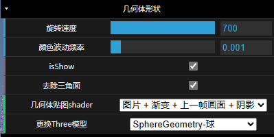
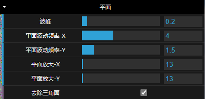
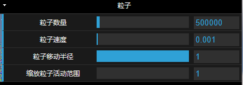
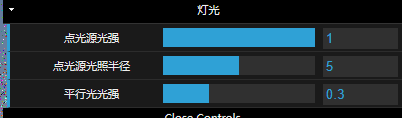
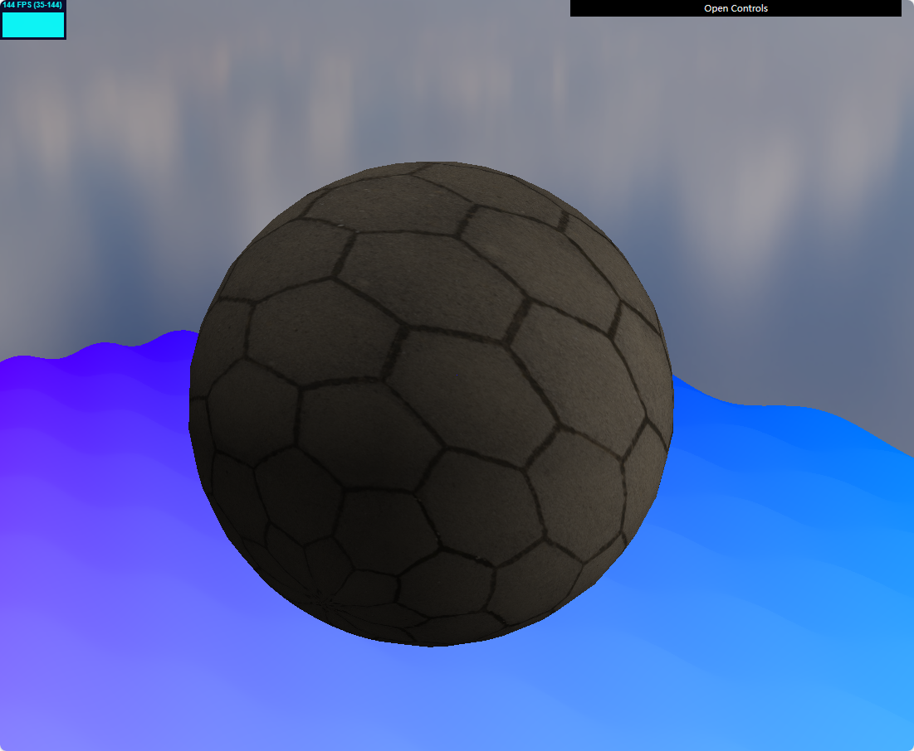

# My WebGPU Demo

## [Install and Run](https://wr40000.github.io/WebGPU-FSX001/)

```
# Clone the repo
git clone https://github.com/wr40000/WebGPU-FSX001.git

# Go inside the folder
cd WebGPU-FSX001

# Start installing dependencies
pnpm install 

# Run project at localhost:8848
pnpm run dev
```

`相机控件:`  鼠标右键按住不放 + W/A/S/D

**目前已实现**

- 点光源 平行光  通过GUI调节光强 光照半径
- 封装threejs的几何体
- 天空盒
- 阴影 --粒子和几何体在平面上的阴影
- 计算管线实现粒子效果，  最大粒子量：16000000

**GUI控件**



作为刚学习WebGPU的小白，代码写的及其臃肿，且下层逻辑封装的非常的牛马，导致现在更新GUI控件代码十分难受，作为自己学习WebGPU的第一个Demo也只能捏着鼻子采取最臃肿的方式暴力完成剩下的部分




`感谢Orillusion团队提供的WebGPU教程`

```
参考资料：
git@github.com:webgpu/webgpu-samples.git
git@github.com:Orillusion/orillusion-webgpu-samples.git
```

脚滑的猫咪

